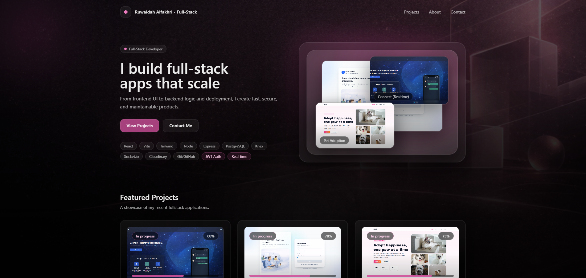
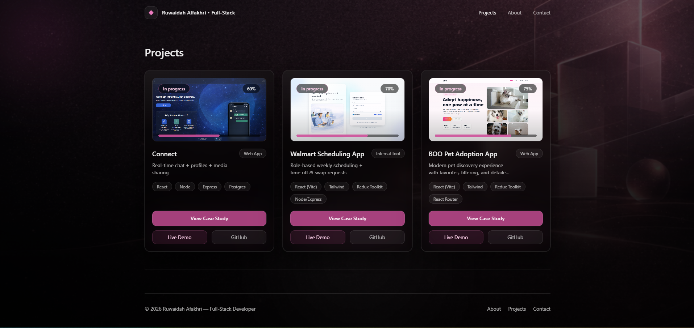
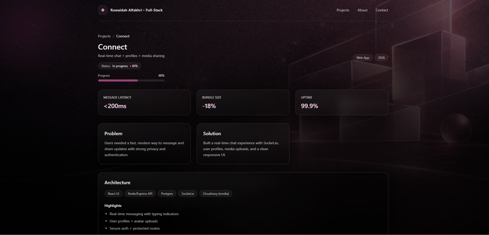
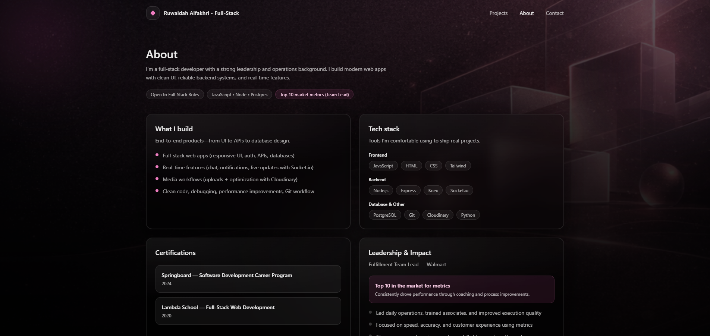
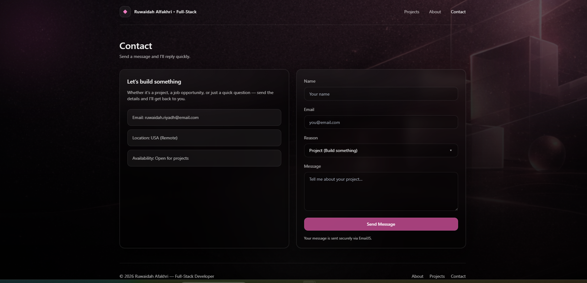

# Ruwaidah Portfolio

A premium dark/pink portfolio website built with **React (Vite)** + **Tailwind CSS**, featuring **project case studies**, **filters/search**, smooth **page animations (Framer Motion)**, and a working **Contact form (EmailJS)**.

## ✨ Features

- **Modern UI**: dark premium theme with glassmorphism + pink glow
- **Projects page**: search + filters (category / tech / year)
- **Case studies**: detailed pages per project (problem, solution, architecture, metrics, progress)
- **Status + progress** badges on project cards
- **Live Demo / GitHub** links on project cards and case studies
- **Contact form** with EmailJS (Project / Job / Connect / Question / Other)
- **Mobile navigation** (slide-over menu)
- **Framer Motion** transitions and hover animations

## 🧰 Tech Stack

**Frontend**
- React (Vite)
- Tailwind CSS
- Framer Motion
- React Router

**Backend / Tools Used in Projects**
- Node.js, Express
- PostgreSQL, Knex
- Socket.io
- Cloudinary
- Git / GitHub

## 📸 Screenshots

## Screenshots

### Home


### Projects


### Case Study


### About


### Contact


## 🚀 Getting Started

### 1) Install dependencies
```bash
npm install